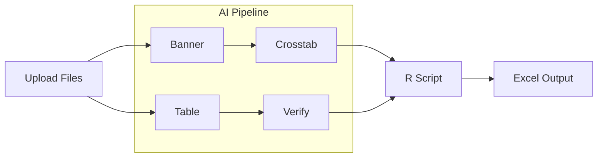

# Architecture TL;DR

> Quick reference for HawkTab AI | Generated 2026-01-17

---

## What Is This?

HawkTab AI automates crosstab generation for market research. It processes survey data through a 4-agent AI pipeline (BannerAgent → CrosstabAgent → TableAgent → VerificationAgent), generates R scripts for statistical calculations with significance testing, and exports publication-quality Excel workbooks. Built for internal use by ~80 market research consultants who need to produce crosstabs that match "Joe's output" - the reference standard.

---

## Architecture at a Glance

---

## Stack

| Layer | Technology |
|-------|------------|
| Framework | Next.js 15 (App Router) |
| Language | TypeScript |
| State | In-memory job store + disk pipeline state |
| Styling | Tailwind CSS + Shadcn UI |
| AI/ML | Vercel AI SDK + Azure OpenAI |
| Output | ExcelJS, R (via subprocess) |

---

## Key Numbers

| Metric | Value |
|--------|-------|
| Files | 241 |
| Lines of Code | 190,841 |
| React Components | 25+ |
| API Routes | 15 |
| AI Agents | 4 |
| Dependencies | 22 production |

---

## Top 5 Key Components

1. **process-crosstab route** (`src/app/api/process-crosstab/route.ts`)
   Main pipeline orchestrator - handles file upload, agent coordination, and output generation

2. **BannerAgent** (`src/agents/BannerAgent.ts`)
   Vision-based extraction of banner structure from PDF/DOCX files

3. **VerificationAgent** (`src/agents/VerificationAgent.ts`)
   Enhances table definitions using survey document context (NETs, T2B, labels)

4. **DataMapProcessor** (`src/lib/processors/DataMapProcessor.ts`)
   Parses CSV datamaps and enriches with parent relationships and type inference

5. **ExcelFormatter** (`src/lib/excel/ExcelFormatter.ts`)
   Transforms calculated tables into publication-quality Excel crosstabs

---

## Notable Patterns

- **Schema-First Development:** Zod schemas define all data contracts with full TypeScript inference
- **Producer-Consumer Queue:** TableAgent produces tables while VerificationAgent consumes them in parallel
- **Per-Agent Configuration:** Each AI agent has independent model, token limit, and reasoning effort settings
- **Two-Tier State:** In-memory for real-time polling, disk-based for durable pipeline history

---

## Red Flags

- **Circular Dependencies (Low):** Type-only imports between DataMapProcessor ↔ DataMapValidator
- **God Route (Medium):** Main API route is 1400+ lines - extract to service layer
- **6 Orphaned Files:** ~22KB of unused code (Shadcn templates, abandoned features)
- **18 Deprecated Functions:** Legacy model getters in env.ts - need migration path documented

---

## Recommended Next Steps

1. **Extract PipelineOrchestrator** - Move orchestration logic from API route to `src/lib/pipeline/orchestrator.ts`
2. **Remove Dead Code** - Delete 6 orphaned files (form.tsx, separator.tsx, switch.tsx, LoadingModal.tsx, outputValidation.ts, bugTrackerTemplate.ts)
3. **Fix Circular Dependencies** - Extract shared types to `src/lib/processors/types.ts`

---

## Quick Links

- [Full Architecture Doc](./ARCHITECTURE.md)
- [Entry Point](../../src/app/page.tsx)
- [API Routes](../../src/app/api/)
- [Agents](../../src/agents/)
- [Schemas](../../src/schemas/)

---

*See [ARCHITECTURE.md](./ARCHITECTURE.md) for complete documentation.*
