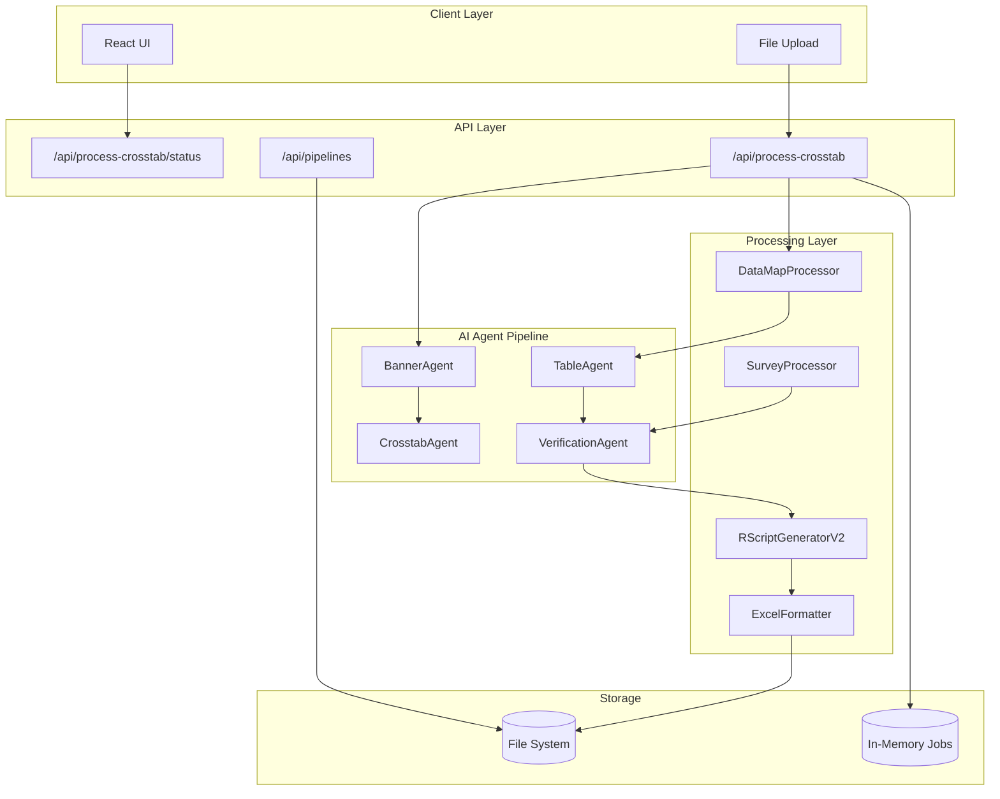
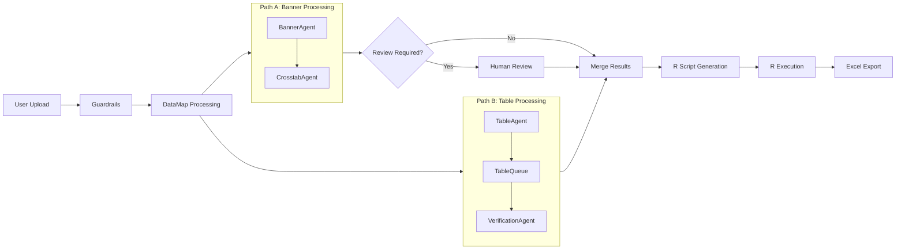
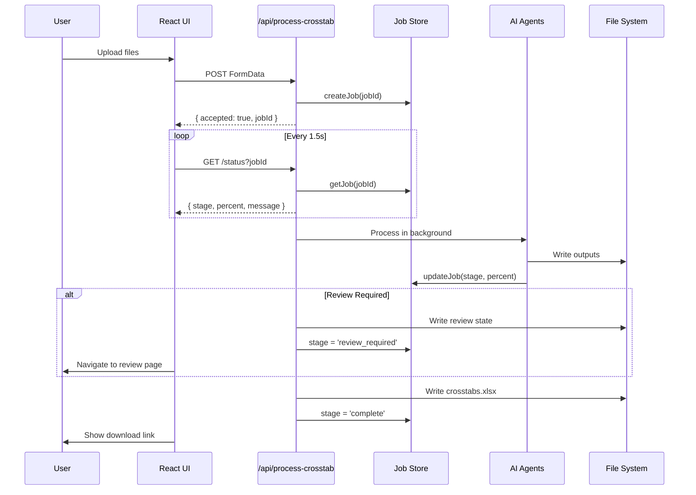
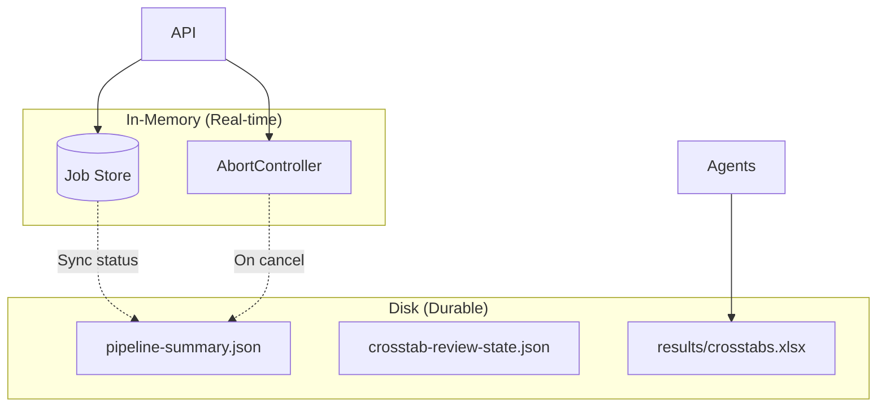
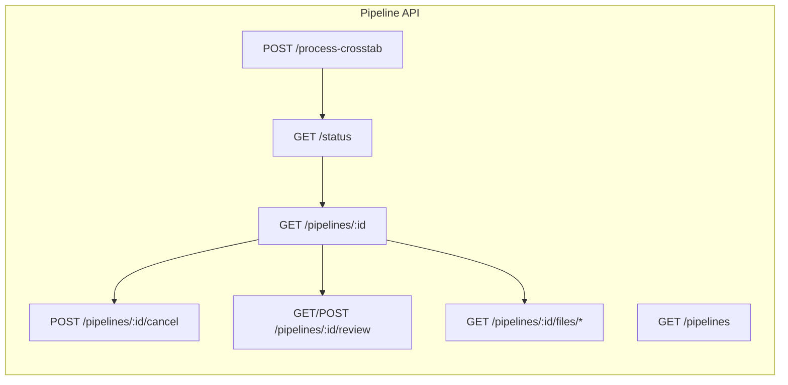

# Architecture Documentation

> Generated by Architecture Review Skill on 2026-01-17

---

## Executive Summary

HawkTab AI is a Next.js 15 application that automates crosstab generation for market research. The system processes survey data through a multi-stage AI agent pipeline (BannerAgent → CrosstabAgent → TableAgent → VerificationAgent), validates mappings with optional human-in-the-loop review, generates R scripts for statistical calculations, and exports publication-quality Excel crosstabs. The architecture follows a hybrid feature-based + layer-based pattern with excellent type safety through Zod schemas and a sophisticated producer-consumer queue for parallel agent execution.

### Key Statistics

| Metric | Value |
|--------|-------|
| Total Files | 241 |
| Total Lines of Code | 190,841 |
| React Components | 25+ |
| API Routes | 15 |
| External Dependencies | 22 production, 8 dev |

### Stack

- **Framework:** Next.js 15 (App Router)
- **Language:** TypeScript
- **State Management:** In-memory job store + disk-based pipeline state
- **Styling:** Tailwind CSS + Shadcn UI
- **AI/ML:** Vercel AI SDK + Azure OpenAI

---

## High-Level Architecture



### Architecture Pattern

**Hybrid Feature-Based + Layer-Based Architecture**

The project combines layer-based separation at the top level (`src/agents/`, `src/lib/`, `src/components/`, `src/schemas/`, `src/prompts/`) with feature-based organization within layers (e.g., prompt variants organized by agent type) and a pipeline-based flow for data processing.

**Evidence:**
- Agents are independent, composable units with distinct concerns
- Schemas define contracts between agents
- Prompts are versioned by agent, not by feature
- Each processor handles a specific file type or transformation
- Producer-consumer queue enables parallel agent execution

---

## Directory Structure

```
hawktab-ai/
├── src/
│   ├── app/                    # Next.js App Router (UI + API)
│   │   ├── api/               # API endpoints
│   │   │   ├── process-crosstab/  # Main pipeline entry
│   │   │   ├── pipelines/         # Pipeline management
│   │   │   └── validation-queue/  # HITL workflow
│   │   ├── pipelines/         # Pipeline detail pages
│   │   └── validate/          # Validation UI
│   ├── agents/                # AI agents (4 core agents)
│   │   ├── BannerAgent.ts     # Vision-based banner extraction
│   │   ├── CrosstabAgent.ts   # R expression validation
│   │   ├── TableAgent.ts      # Table structure decisions
│   │   ├── VerificationAgent.ts # Survey-aware enhancement
│   │   └── tools/             # Shared agent tools (scratchpad)
│   ├── schemas/               # Zod type definitions
│   │   ├── dataMapSchema.ts
│   │   ├── bannerPlanSchema.ts
│   │   ├── tableAgentSchema.ts
│   │   ├── verificationAgentSchema.ts
│   │   └── index.ts           # Central exports + compilation test
│   ├── lib/                   # Core utilities
│   │   ├── env.ts             # Per-agent model configuration
│   │   ├── jobStore.ts        # In-memory job tracking
│   │   ├── processors/        # Data transformations
│   │   ├── excel/             # Excel output generation
│   │   ├── r/                 # R script generation
│   │   ├── tables/            # Table processing
│   │   └── pipeline/          # Pipeline coordination (TableQueue)
│   ├── components/            # React UI components
│   │   ├── ui/               # Shadcn UI library
│   │   └── *.tsx             # Custom components
│   ├── prompts/               # AI agent prompt templates
│   │   ├── banner/           # production.ts + alternative.ts
│   │   ├── crosstab/
│   │   ├── table/
│   │   └── verification/
│   ├── guardrails/            # Input validation
│   └── hooks/                 # Custom React hooks
├── scripts/                   # CLI test scripts
├── data/                      # Test datasets
├── outputs/                   # Pipeline outputs (gitignored)
└── docs/                      # Documentation
```

### Directory Purposes

| Directory | Purpose |
|-----------|---------|
| `src/agents/` | AI agents using Vercel AI SDK for processing survey data |
| `src/schemas/` | Zod schema definitions for type-safe data contracts |
| `src/lib/` | Shared utilities: processors, formatters, generators |
| `src/lib/pipeline/` | Producer-consumer coordination (TableQueue) |
| `src/lib/excel/` | Excel output generation with table renderers |
| `src/lib/r/` | R script generation for statistical calculations |
| `src/prompts/` | Versioned prompt templates (production + alternative) |
| `src/components/` | React UI components + Shadcn library |
| `src/guardrails/` | Pre-processing validation (file types, sizes) |
| `scripts/` | CLI scripts for pipeline testing |

---

## Entry Points

| File | Type | Description |
|------|------|-------------|
| `src/app/page.tsx` | Next.js Page | Main upload UI |
| `src/app/api/process-crosstab/route.ts` | API Route | Pipeline orchestration endpoint |
| `src/app/api/pipelines/route.ts` | API Route | List all pipelines |
| `src/app/api/pipelines/[pipelineId]/route.ts` | API Route | Pipeline details |
| `src/app/api/pipelines/[pipelineId]/review/route.ts` | API Route | HITL review workflow |
| `scripts/test-pipeline.ts` | CLI Script | Full pipeline test runner |

### Pipeline Flow



---

## Data Flow

### Request/Response Flow



### State Management

**Two-Tier State Architecture:**

1. **In-Memory Job Store** (`src/lib/jobStore.ts`)
   - Real-time UI polling during active processing
   - Tracks: stage, percent, message, pipelineId, reviewRequired
   - Supports cancellation via AbortController
   - NOT persisted across server restarts

2. **Disk-Based Pipeline State** (`outputs/{dataset}/pipeline-{timestamp}/`)
   - Durable storage for resumable pipelines and history
   - Files: pipeline-summary.json, crosstab-review-state.json
   - Enables recovery after page reload or server restart



---

## Component Inventory

### Key Components

| Component | File | Props | Hooks Used |
|-----------|------|-------|------------|
| Home | `src/app/page.tsx` | - | useState, useEffect, useRouter, useValidationQueue |
| PipelineDetailPage | `src/app/pipelines/[pipelineId]/page.tsx` | params | useState, useEffect, useRouter |
| ReviewPage | `src/app/pipelines/[pipelineId]/review/page.tsx` | params | useState, useEffect, useRouter |
| ValidationQueue | `src/app/validate/page.tsx` | - | useState, useCallback, useEffect, useRouter |
| FileUpload | `src/components/FileUpload.tsx` | onUpload, disabled | useState |
| PipelineHistory | `src/components/PipelineHistory.tsx` | pipelines, onSelect | - |
| StatusBadge | `src/components/StatusBadge.tsx` | status, variant, className | - |

### Context Providers

| Context | Provider Location | Consumers |
|---------|-------------------|-----------|
| ThemeProvider | `src/app/layout.tsx` | All components |

### Custom Hooks

| Hook | File | Usage |
|------|------|-------|
| useValidationQueue | `src/hooks/useValidationQueue.ts` | Home page - validation queue counts |

---

## API Surface

### Routes

| Method | Path | Purpose |
|--------|------|---------|
| POST | `/api/process-crosstab` | Start pipeline processing |
| GET | `/api/process-crosstab/status` | Poll job status |
| GET | `/api/pipelines` | List all pipelines |
| GET | `/api/pipelines/[pipelineId]` | Get pipeline details |
| POST | `/api/pipelines/[pipelineId]/cancel` | Cancel running pipeline |
| GET/POST | `/api/pipelines/[pipelineId]/review` | HITL review workflow |
| GET | `/api/pipelines/[pipelineId]/files/[...path]` | Download pipeline files |
| GET/POST | `/api/validation-queue` | Validation queue management |

### API Diagram



---

## Dependency Analysis

### Internal Dependencies

#### Most Connected Modules

| Module | Imports From | Imported By |
|--------|--------------|-------------|
| `src/lib/env.ts` | - | All agents, API routes, processors |
| `src/schemas/` | tableAgentSchema (by verification) | All agents, processors, formatters |
| `src/agents/` | env, schemas, prompts, tools | API routes |
| `src/lib/r/RScriptGeneratorV2.ts` | schemas, CutsSpec | API route, tests |
| `src/lib/excel/ExcelFormatter.ts` | renderers, styles | API route, scripts |

#### Circular Dependencies

**Found: 2 (type-only, low severity)**

1. `DataMapProcessor.ts` → `DataMapValidator.ts` → `ProcessedDataMapVariable` type from `DataMapProcessor.ts`
2. `DataMapProcessor.ts` → `SPSSReader.ts` → `ProcessedDataMapVariable` type from `DataMapProcessor.ts`

**Impact:** These are type-only imports that don't cause runtime issues but violate clean architecture principles.

**Recommendation:** Extract `ProcessedDataMapVariable` type to `src/lib/processors/types.ts`.

### External Dependencies

| Package | Version | Category |
|---------|---------|----------|
| ai (Vercel SDK) | 6.0.5 | AI/ML |
| @ai-sdk/azure | 3.0.2 | AI/ML |
| zod | 3.25.76 | Validation |
| exceljs | 4.4.0 | Output |
| pdf-lib | 1.17.1 | Document Processing |
| mammoth | 1.10.0 | Document Processing |
| sharp | 0.34.3 | Image Processing |
| next | 15.4.6 | Framework |
| react | 19.1.0 | UI |

---

## Configuration

### Environment Variables

| Variable | Purpose | Required |
|----------|---------|----------|
| AZURE_API_KEY | Azure OpenAI API key | Yes |
| AZURE_RESOURCE_NAME | Azure resource name | Yes |
| AZURE_API_VERSION | API version | Yes (default: 2024-12-01-preview) |
| CROSSTAB_MODEL | Model for CrosstabAgent | No (default: o4-mini) |
| BANNER_MODEL | Model for BannerAgent | No (default: gpt-5-nano) |
| TABLE_MODEL | Model for TableAgent | No (default: gpt-5-nano) |
| VERIFICATION_MODEL | Model for VerificationAgent | No (default: gpt-5-mini) |
| *_REASONING_EFFORT | Reasoning effort per agent | No (default: varies) |
| *_MODEL_TOKENS | Token limits per agent | No (default: varies) |
| *_PROMPT_VERSION | Prompt version per agent | No (default: production) |
| TRACING_ENABLED | Enable observability | No (default: true) |

### Configuration Files

| File | Type | Purpose |
|------|------|---------|
| next.config.ts | Next.js | Framework configuration |
| tsconfig.json | TypeScript | Compiler configuration |
| package.json | npm | Dependencies and scripts |
| .env.local | Environment | Local development variables |
| .env.example | Environment | Template for required variables |
| .env.production | Environment | Production variables |

---

## Detected Patterns

### Architectural Patterns

**1. Agent Pattern** (Excellent - 9/10)
- All 4 agents follow identical structure: entry point → AI call → retry logic → dual output
- Consistent use of scratchpad tool for reasoning transparency
- Clean separation of concerns with single responsibility

**2. Schema-First Development** (Excellent - 9/10)
- Zod schemas define all data contracts
- Full TypeScript inference via `z.infer<typeof Schema>`
- Compilation test in `schemas/index.ts` validates all schemas at startup

**3. Producer-Consumer Queue** (Good - 8/10)
- `TableQueue` enables overlapping TableAgent → VerificationAgent execution
- Sophisticated async coordination with Promise-based blocking
- Limited to one agent pair (opportunity to extend)

**4. Configuration Management** (Excellent - 9/10)
- Per-agent model selection via environment variables
- Factory pattern with lazy initialization for Azure provider
- Backward compatibility with deprecated legacy functions

### Code Patterns

- **Callback-based streaming:** TableAgent produces tables incrementally
- **Abort signal propagation:** All agents respect cancellation requests
- **Dual output pattern:** Verbose (debugging) + simplified (downstream)
- **Retry with policy handling:** Centralized retry logic for Azure errors
- **Export hub pattern:** Central re-exports with compilation test

### Anti-Patterns Detected

**1. God Route** (Medium Priority)
- `src/app/api/process-crosstab/route.ts` is 1400+ lines
- Orchestrates entire pipeline, handles file I/O, manages jobs
- **Recommendation:** Extract to `PipelineOrchestrator` service class

**2. Missing Service Layer** (Medium Priority)
- Business logic mixed with HTTP handling in API routes
- No separation between orchestration and API concerns
- **Recommendation:** Create `src/lib/pipeline/orchestrator.ts`

**3. Code Duplication Across Agents** (~200 lines)
- Identical patterns: abort signal checks, scratchpad collection, error fallback
- **Recommendation:** Create `AgentBase` abstract class or factory

---

## Anomalies & Technical Debt

### Orphaned Files

Files that are not imported anywhere and don't appear to be entry points:

| File | Reason | Action |
|------|--------|--------|
| `src/components/ui/form.tsx` | Shadcn template, unused | Remove |
| `src/components/ui/separator.tsx` | Shadcn template, unused | Remove |
| `src/components/ui/switch.tsx` | Shadcn template, unused | Remove |
| `src/components/LoadingModal.tsx` | Replaced by toast notifications | Remove |
| `src/guardrails/outputValidation.ts` | Feature never integrated | Remove |
| `src/lib/utils/bugTrackerTemplate.ts` | Feature never integrated | Remove |

### Large Files

Files exceeding 500 lines that may need refactoring:

| File | Lines | Notes |
|------|-------|-------|
| `src/app/api/process-crosstab/route.ts` | 1437 | Pipeline orchestration - extract to service |
| `scripts/compare-to-golden.ts` | 988 | Test script - acceptable |
| `src/lib/processors/DataMapProcessor.ts` | ~870 | Consider splitting into smaller processors |
| `src/agents/BannerAgent.ts` | 666 | Acceptable for vision processing complexity |
| `scripts/test-pipeline.ts` | 631 | Test script - acceptable |
| `src/agents/TableAgent.ts` | 570 | Acceptable |

### TODO/FIXME Comments

| Type | Count |
|------|-------|
| DEPRECATED | 18 |
| WARNING | 20 |
| BUG | 8 |
| XXX | 4 |
| TODO | 1 |

Notable items:
- `src/lib/env.ts`: 18 deprecated functions (backward compatibility maintained)
- `src/agents/tools/scratchpad.ts`: TODO for migrating to agent-specific tools
- `src/guardrails/inputValidation.ts`: Uses deprecated `getModelTokenLimit()`

---

## Recommendations

### High Priority

1. **Extract Pipeline Orchestration**
   - Move orchestration from `process-crosstab/route.ts` to `src/lib/pipeline/orchestrator.ts`
   - Keep API route thin (validation, error handling, response formatting)
   - Improves testability and maintainability

2. **Fix Circular Dependencies**
   - Extract `ProcessedDataMapVariable` type to `src/lib/processors/types.ts`
   - Update imports in DataMapProcessor, DataMapValidator, SPSSReader

3. **Remove Dead Code**
   - Delete 6 orphaned files (~22KB total)
   - `form.tsx`, `separator.tsx`, `switch.tsx`, `LoadingModal.tsx`
   - `outputValidation.ts`, `bugTrackerTemplate.ts`

### Medium Priority

4. **Update Deprecated Function Usage**
   - `src/guardrails/inputValidation.ts` uses deprecated `getModelTokenLimit()`
   - Migrate to per-agent token limits

5. **Create Agent Base Class**
   - Extract common agent logic (abort handling, scratchpad, retry)
   - Reduce ~200 lines of duplication across 4 agents

6. **Add Loading States**
   - Add `loading.tsx` for pipeline and review pages
   - Currently only `/validate/` has loading skeleton

### Low Priority / Nice to Have

7. **Document Configuration Precedence**
   - Add MIGRATION.md explaining legacy → per-agent model transition
   - Document the 3-level default hierarchy for environment variables

8. **Extend Producer-Consumer Pattern**
   - Consider applying TableQueue pattern to more agent transitions
   - Could improve overall pipeline parallelization

9. **Add Observability Integration**
   - Integrate structured logging library (Pino)
   - Connect to external tracing service

---

## Appendix

### File Categories

| Category | File Count | Total Lines |
|----------|------------|-------------|
| Source (.ts/.tsx) | 111 | ~16,000 |
| Configuration | 6 | ~150 |
| Documentation | 15 | ~3,800 |
| Data (JSON) | 100+ | ~170,000 |

### Scan Details

- **Scan Date:** 2026-01-17
- **Files Analyzed:** 111 source files
- **Scripts Used:** file_tree_analyzer, entry_point_detector, dependency_mapper, dead_code_detector, api_surface_extractor, config_extractor, component_census

---

*This document was generated by the Architecture Review skill. For questions or updates, run `/architecture-review` again.*
