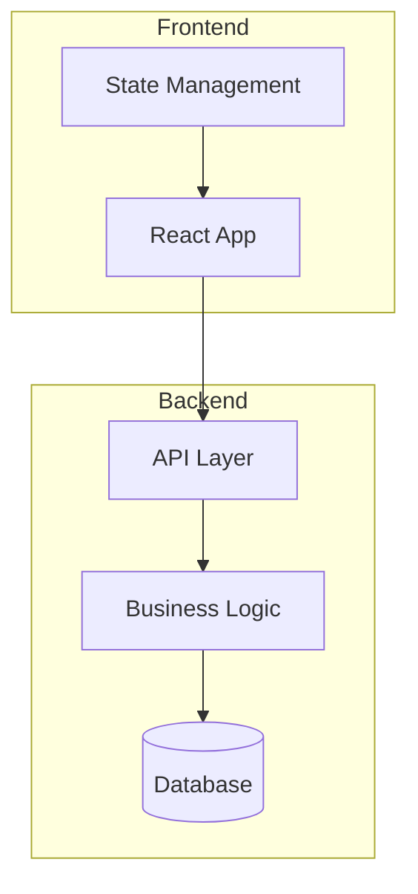
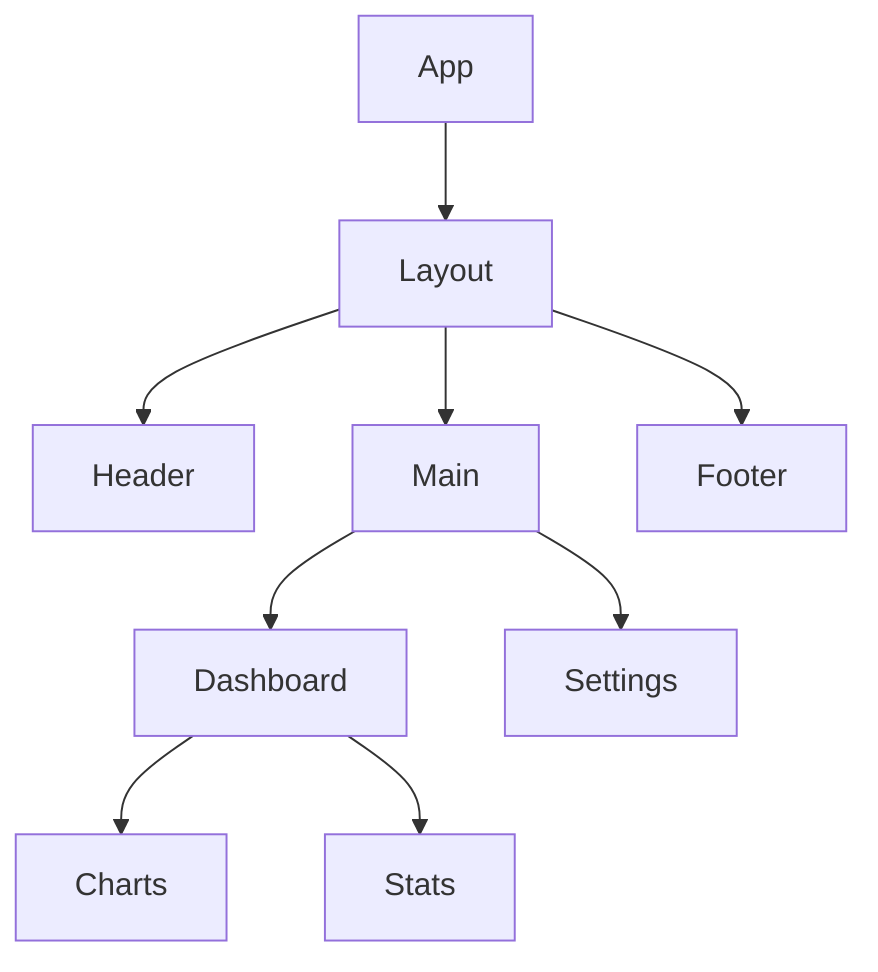
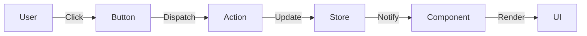
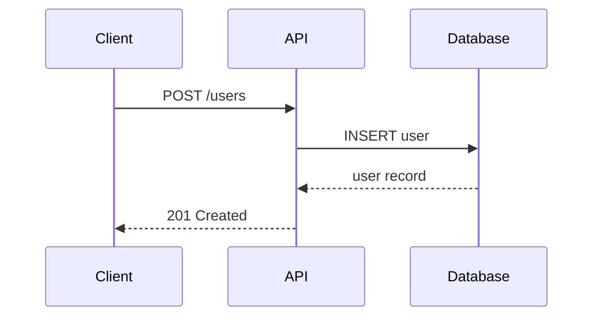
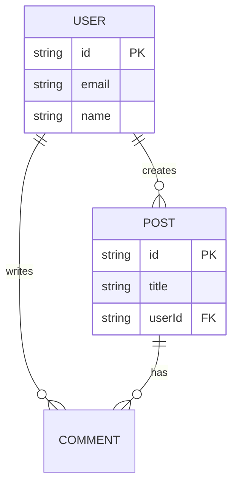
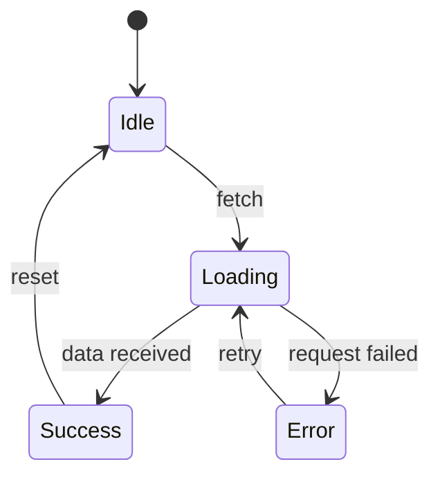
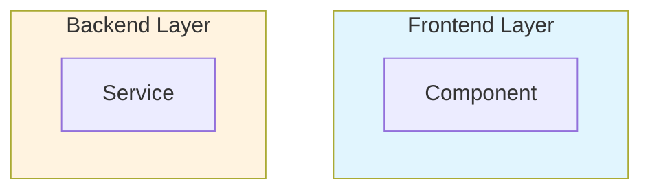
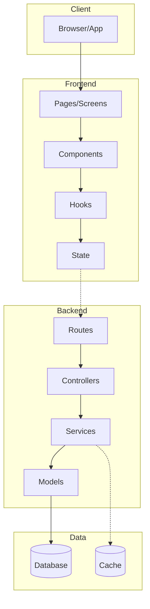
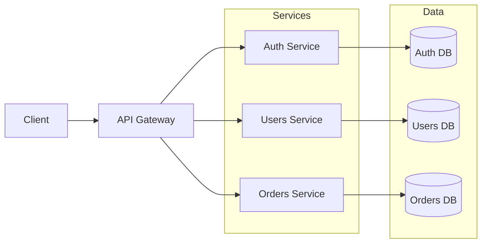
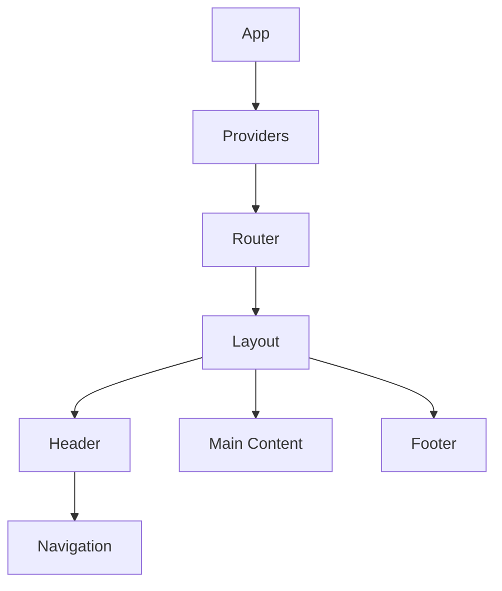

# Mermaid Diagram Guidelines

Guidelines for generating clear, useful architecture diagrams using Mermaid syntax.

---

## Core Principles

1. **Simplicity** - Keep diagrams simple and focused (5-10 nodes max for high-level views)
2. **Clarity** - Labels should be immediately understandable
3. **Purpose** - Each diagram should answer a specific question
4. **Consistency** - Use consistent styling within the same document

---

## Diagram Types

### 1. High-Level Architecture (Flowchart)

Use for: Overall system structure, layer relationships

**Guidelines:**
- Maximum 10 nodes for readability
- Group related components in subgraphs
- Use clear, short labels
- Show primary data flow direction

### 2. Component Hierarchy (Flowchart TD)

Use for: React component structure, module organization

**Guidelines:**
- Top-down flow for parent-child relationships
- Limit depth to 4 levels for clarity
- Only show significant components

### 3. Data Flow (Flowchart LR)

Use for: Request/response flow, state updates, event flow

**Guidelines:**
- Left-to-right for sequential flows
- Label edges with actions/events
- Show key transformation points

### 4. Sequence Diagrams

Use for: API interactions, async flows, authentication flows

**Guidelines:**
- Use short participant aliases
- Show success path primarily
- Note error handling separately if needed
- Limit to 5-6 participants

### 5. Entity Relationship (ER Diagram)

Use for: Database schema, data models

**Guidelines:**
- Show key relationships only
- Include primary and foreign keys
- Limit to core entities (5-8)

### 6. State Diagrams

Use for: Application states, component states, workflow states

**Guidelines:**
- Start with initial state `[*]`
- Label all transitions
- Keep states at 6-8 maximum

---

## Styling Guidelines

### Node Shapes

| Shape | Syntax | Use For |
|-------|--------|---------|
| Rectangle | `[Label]` | General components |
| Rounded | `(Label)` | Processes, actions |
| Stadium | `([Label])` | Start/end points |
| Cylinder | `[(Label)]` | Database, storage |
| Diamond | `{Label}` | Decision points |

### Color Coding

Use subgraph styling for visual grouping:

### Arrow Types

| Arrow | Syntax | Meaning |
|-------|--------|---------|
| Solid | `-->` | Direct dependency/call |
| Dotted | `-.->` | Optional/async |
| Thick | `==>` | Primary flow |
| With label | `-->|label|` | Named relationship |

---

## Templates

### Full Stack Application

### Microservices Overview

### React Component Tree

---

## Common Mistakes to Avoid

1. **Too many nodes** - Split into multiple focused diagrams
2. **Unclear labels** - Use specific names, not generic "Component 1"
3. **Crossing arrows** - Rearrange nodes to minimize crossings
4. **Missing context** - Include brief title/description
5. **Over-styling** - Keep colors minimal and meaningful
6. **Wrong diagram type** - Match diagram type to what you're showing

---

## Rendering Notes

- Mermaid diagrams render in GitHub, VS Code, and most markdown viewers
- Test diagrams in the [Mermaid Live Editor](https://mermaid.live/)
- Some complex diagrams may need adjustment for different renderers
- Keep line lengths reasonable for code readability
