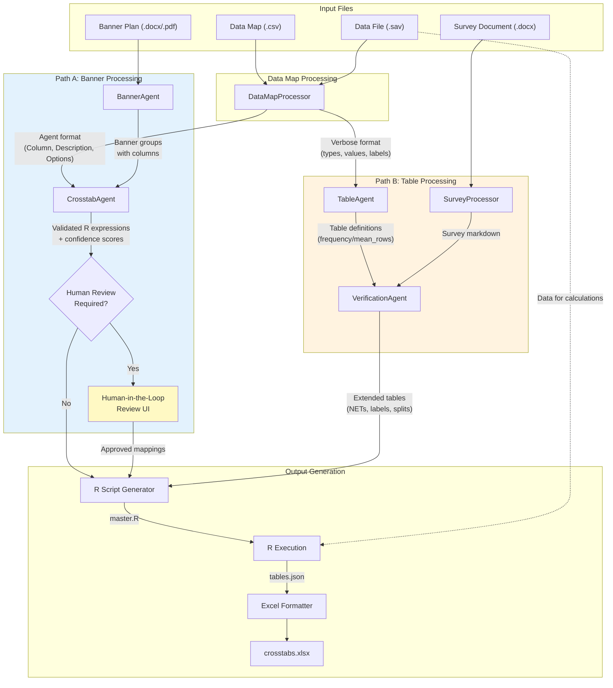

# HawkTab AI - Architecture Overview

This document describes how data flows through the HawkTab AI pipeline, from input files to final Excel crosstabs.

---

## Pipeline Flow



**Path A** (blue) and **Path B** (orange) execute **in parallel**. If human review is needed, Path A pauses while Path B continues. When review completes, the paths converge for output generation.

---

## Stage Descriptions

### 1. Input Files

| File | Purpose | Required |
|------|---------|----------|
| **Data Map** (.csv) | Variable definitions exported from SPSS - column names, descriptions, value labels | Yes |
| **Banner Plan** (.docx/.pdf) | Defines the banner cuts (columns) for crosstabs - groups like "Total", "Gender", "Region" | Yes |
| **Data File** (.sav) | SPSS data file with survey responses | Yes |
| **Survey Document** (.docx) | Original survey questionnaire - used to enhance table labels and structure | Optional |

---

### 2. DataMapProcessor

**Purpose:** Parse and normalize the data map into formats optimized for each downstream agent.

**What it does:**
- Reads the CSV data map and SPSS file metadata
- Classifies each variable's type (categorical, numeric range, binary flag, etc.)
- Extracts value labels and valid ranges from SPSS
- Groups child variables under parent questions (e.g., `Q5r1`, `Q5r2` → parent `Q5`)

**Outputs two formats:**

| Format | Consumer | Contents |
|--------|----------|----------|
| **Agent format** | CrosstabAgent | Simplified: `Column`, `Description`, `Answer_Options` |
| **Verbose format** | TableAgent | Full metadata: normalized types, value labels, ranges, parent relationships |

---

### 3. Path A: Banner Processing

#### 3a. BannerAgent

**Purpose:** Extract structured banner information from the banner plan document.

**Input:** Banner plan document (PDF or DOCX)

**What it does:**
- Converts document to images (PDF) or parses directly (DOCX)
- Uses vision capabilities to identify banner groups and columns
- Extracts the "original" filter expression for each column (e.g., "S2=1", "IF TEACHER", "Segment A from list")

**Output:** Banner groups with columns:
```
[
  {
    groupName: "Gender",
    columns: [
      { name: "Male", original: "S2=1" },
      { name: "Female", original: "S2=2" }
    ]
  },
  ...
]
```

#### 3b. CrosstabAgent

**Purpose:** Validate banner expressions against the data map and generate executable R syntax.

**Input:** Banner groups from BannerAgent + Agent-format data map

**What it does:**
- Processes groups **one at a time** (group-by-group strategy)
- For each column, searches the data map to find matching variables
- Classifies the expression type (direct variable, conceptual filter, placeholder, etc.)
- Generates valid R syntax (e.g., `S2=1` → `S2 == 1`)
- Assigns confidence scores based on match quality
- Flags columns for human review when uncertain

**Output per column:**
```
{
  name: "Male",
  adjusted: "S2 == 1",           // R syntax
  confidence: 0.95,
  reason: "Exact variable match...",
  expressionType: "direct_variable",
  humanReviewRequired: false,
  alternatives: [],
  uncertainties: []
}
```

#### 3c. Human-in-the-Loop Review

**Triggered when:** Any column has `confidence < 0.75`, `humanReviewRequired: true`, or expression type that requires verification (`placeholder`, `conceptual_filter`, `from_list`).

**What the user sees:**
- Each flagged column with proposed R expression
- AI's reasoning and confidence score
- Alternative mappings (if found)
- Specific concerns/uncertainties

**User actions:**
| Action | Result |
|--------|--------|
| **Approve** | Use the proposed R expression |
| **Select Alternative** | Use a different candidate mapping |
| **Provide Hint** | Re-run CrosstabAgent for that column with user context |
| **Edit Directly** | User provides exact R expression |
| **Skip** | Exclude this cut from final output |

**Note:** While the user reviews, Path B has already completed. Resume is fast.

---

### 4. Path B: Table Processing

#### 4a. TableAgent

**Purpose:** Decide how each survey question should be displayed as a crosstab table.

**Input:** Verbose-format data map (with types, values, parent groupings)

**What it does:**
- Groups variables by parent question
- Analyzes variable types and value structures
- Decides table type: **frequency** (categorical) or **mean_rows** (numeric)
- Determines row structure and filter values
- Adds hints for derived tables (T2B for 5-point scales, combined rankings, etc.)

**Output per question:**
```
{
  questionId: "Q5",
  questionText: "How satisfied are you with...",
  tables: [
    {
      tableId: "q5_satisfaction",
      tableType: "frequency",
      rows: [
        { variable: "Q5", label: "Very satisfied", filterValue: "5" },
        { variable: "Q5", label: "Satisfied", filterValue: "4" },
        ...
      ],
      hints: ["scale-5"]
    }
  ],
  confidence: 0.92
}
```

#### 4b. SurveyProcessor

**Purpose:** Convert the survey document to searchable markdown for the VerificationAgent.

**Input:** Survey document (DOCX)

**What it does:**
- Extracts text content from Word document
- Converts to markdown format
- Preserves question numbering and answer options

**Output:** Survey content as markdown string

#### 4c. VerificationAgent

**Purpose:** Enhance table definitions using the actual survey document.

**Input:** Table definitions from TableAgent + Survey markdown + Verbose data map

**What it does:**
- Fixes labels: Replaces generic "Value 1" with actual survey answer text
- Adds NET rows: Creates roll-up rows for grouped options
- Creates derived tables: T2B/B2B for satisfaction scales
- Splits tables: Separates by treatment/condition when appropriate
- Flags exclusions: Marks low-value tables for reference sheet

**Output:** Extended table definitions with enhanced metadata:
```
{
  tableId: "q5_satisfaction",
  rows: [
    { variable: "Q5", label: "Very satisfied", filterValue: "5", isNet: false, indent: 0 },
    { variable: "Q5", label: "Top 2 Box", filterValue: "4,5", isNet: true, indent: 0 },
    ...
  ],
  isDerived: false,
  exclude: false
}
```

---

### 5. Output Generation

#### 5a. R Script Generator

**Purpose:** Generate executable R code that calculates crosstab statistics.

**Inputs:**
- Validated banner cuts (R expressions) from CrosstabAgent
- Extended table definitions from VerificationAgent

**What it does:**
- Builds a "cuts spec" from banner mappings
- Generates R code for each table × cut combination
- Calculates counts, percentages, means (depending on table type)
- Performs significance testing (unpooled z-test)
- Outputs results as JSON

**Output:** `master.R` script

#### 5b. R Execution

**Purpose:** Run the generated R script against the actual survey data.

**Inputs:**
- `master.R` script
- SPSS data file (.sav)

**What it does:**
- Loads SPSS data via `haven` package
- Executes all table calculations
- Performs significance testing between banner columns
- Writes results to JSON

**Output:** `tables.json` with calculated statistics

#### 5c. Excel Formatter

**Purpose:** Format calculated results into a publication-ready Excel workbook.

**Input:** `tables.json`

**What it does:**
- Creates one worksheet per table
- Applies standard crosstab formatting
- Adds significance letters (A, B, C, etc.)
- Formats percentages, bases, and statistics

**Output:** `crosstabs.xlsx`

---

## Key Design Decisions

1. **Parallel paths** - Banner and table processing are independent, so they run simultaneously (~14 minutes saved)

2. **Review after CrosstabAgent, not BannerAgent** - Banner extraction is straightforward; mapping expressions to variables is where uncertainty lives

3. **Batch review, not per-group** - Showing all flagged columns at once is less disruptive than interrupting after each group

4. **Path B completes during review** - Tables are ready when the user finishes reviewing, so resume is fast

5. **Group-by-group processing** - CrosstabAgent processes one banner group at a time to stay within token limits and improve reliability
