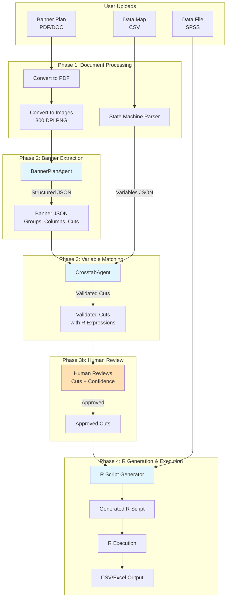
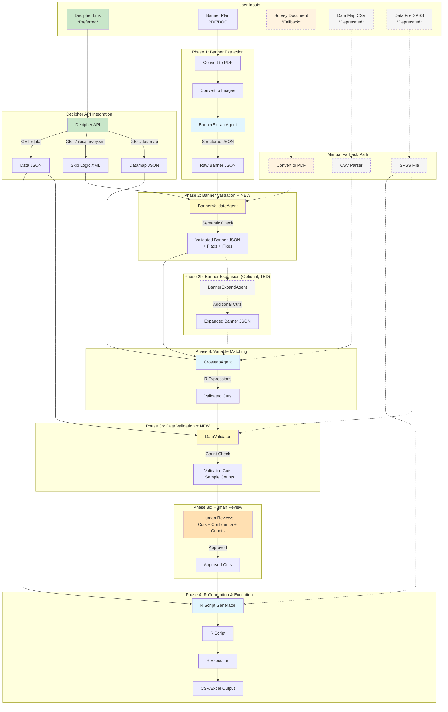
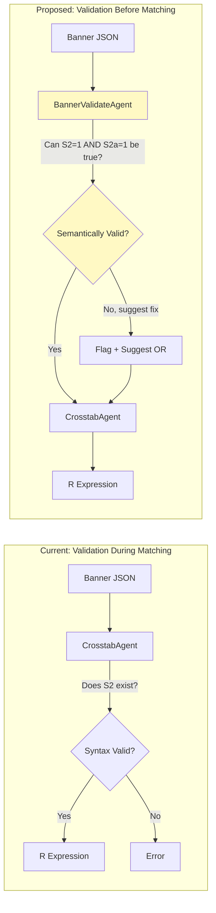
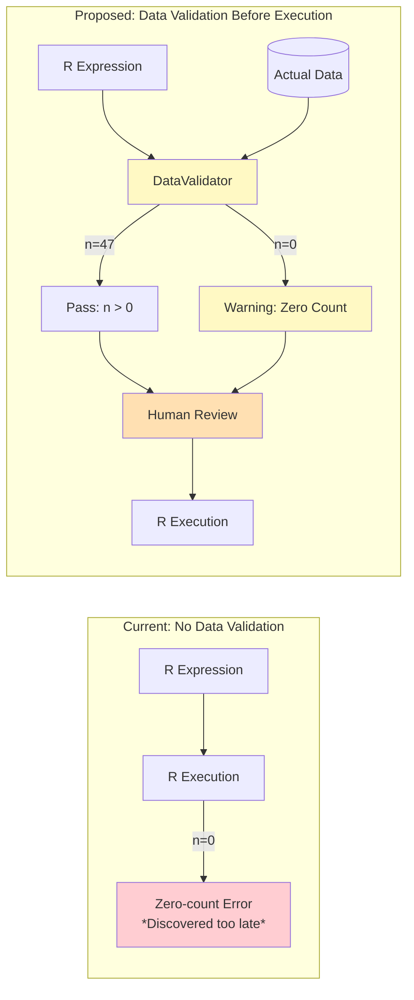

# HawkTab AI: Agent Flow Architecture

This document describes how the system processes survey data into crosstabs, both the current implementation and the proposed improvements.

---

## Current System Flow

### User Inputs (3 files)

| Input | Format | Purpose |
|-------|--------|---------|
| **Banner Plan** | PDF/DOC/DOCX | Defines what columns/cuts to include in crosstabs |
| **Data Map** | CSV | Variable definitions, labels, allowed values |
| **Data File** | SPSS (.sav) | Actual respondent data |

### Processing Pipeline

### Agent Descriptions

#### BannerPlanAgent
- **Input**: Images of banner plan document
- **Task**: Extract banner structure from visual document
- **Output**: Structured JSON with groups, columns, cuts, stat letters
- **Model**: GPT-4o (vision-capable)

#### CrosstabAgent
- **Input**: Banner JSON + Data Map JSON
- **Task**: Match banner expressions to actual variables, generate R syntax
- **Output**: Validated cuts with R expressions and confidence scores
- **Model**: o4-mini (reasoning)
- **Validation**: Checks if variables exist in data map (syntax validation)

#### R Script Generator
- **Input**: Validated cuts + SPSS data file path
- **Task**: Generate complete R script for crosstab calculations
- **Output**: Executable R script with statistical tests

### Current Limitations

| Issue | Root Cause |
|-------|------------|
| **AND/OR logic errors** | Agent interprets banner literally without understanding skip logic |
| **Zero-count cuts** | No validation that cuts will produce results before R execution |
| **Overconfident validation** | Agent validates syntax but not semantic correctness |
| **Fragile data map parsing** | CSV state machine infers relationships, doesn't know skip logic |

---

## Proposed System Flow

### User Inputs (5 options, 2 paths)

| Input | Format | Status | Purpose |
|-------|--------|--------|---------|
| **Decipher Survey Link** | URL | *New, Preferred* | Direct API access to survey structure, data, and skip logic |
| **Banner Plan** | PDF/DOC/DOCX | Current | Defines columns/cuts (or auto-generated from survey) |
| **Survey Document** | PDF/DOC | *New, Fallback* | Questionnaire for understanding skip logic when no API access |
| **Data Map** | CSV | *Deprecated* | Replaced by Decipher API datamap |
| **Data File** | SPSS (.sav) | *Deprecated* | Replaced by Decipher API data export |

### Processing Pipeline (Proposed)

### Agent Descriptions (Proposed)

#### BannerExtractAgent (Renamed from BannerPlanAgent)
- **Input**: Images of banner plan document
- **Task**: Extract banner structure from visual document
- **Output**: Raw structured JSON with groups, columns, cuts
- **Model**: GPT-4o (vision-capable)
- **Change from current**: Name change only, same functionality

#### BannerValidateAgent ⭐ NEW
- **Input**: Raw Banner JSON + Skip Logic (from survey.xml or survey document)
- **Task**: Validate that banner cuts are semantically/logically possible
- **Output**: Validated Banner JSON with flags, suggested fixes, confidence adjustments
- **Model**: o4-mini (reasoning)
- **Key validation**:
  - Can `S2=1 AND S2a=1` ever be true? (Check skip logic)
  - Are there impossible combinations?
  - Suggest fixes: "Did you mean OR instead of AND?"
  - Add context notes for downstream agents

#### BannerExpandAgent (Optional, TBD)
- **Input**: Validated Banner JSON + Survey Context
- **Task**: Suggest additional useful cuts based on survey content
- **Output**: Expanded Banner JSON with suggested additional columns
- **Model**: o4-mini (reasoning)
- **Status**: Not in initial scope, architecture supports adding later
- **Use case**: "What other cuts would be useful for this survey?"

#### CrosstabAgent (Unchanged)
- **Input**: Validated Banner JSON + Data Map
- **Task**: Match banner expressions to actual variables, generate R syntax
- **Output**: Validated cuts with R expressions
- **Model**: o4-mini (reasoning)
- **Change from current**: Receives pre-validated input, less validation burden

#### DataValidator ⭐ NEW
- **Input**: Validated Cuts (R expressions) + Actual Data (from Decipher API or SPSS)
- **Task**: Run sample queries against actual data to validate cuts produce results
- **Output**: Validated cuts with sample counts, zero-count warnings
- **Model**: Not AI-based (code execution)
- **Key validation**:
  - Does this cut have any matching respondents?
  - What's the sample size for this cut?
  - Flag cuts with n=0 or very low counts
  - Provide counts for human review decision-making

#### Human Review
- **Input**: Validated cuts + Confidence scores + Sample counts
- **Task**: Human reviews AI-generated cuts before R execution
- **Output**: Approved cuts ready for R script generation
- **Key features**:
  - See confidence scores per cut
  - See sample counts per cut (from DataValidator)
  - Approve, reject, or modify cuts
  - Override low-confidence or zero-count warnings

#### R Script Generator (Unchanged)
- **Input**: Approved cuts + Data (SPSS or JSON)
- **Task**: Generate complete R script
- **Output**: Executable R script

---

## Key Differences: Current vs Proposed

| Aspect | Current | Proposed |
|--------|---------|----------|
| **Data source** | Manual file uploads | Decipher API (preferred) + manual fallback |
| **Skip logic** | Inferred by AI | Explicit from survey.xml or survey document |
| **Banner validation** | Syntax only (does variable exist?) | Semantic (is this logically possible?) |
| **Data validation** | None (errors found at R execution) | DataValidator checks counts before execution |
| **Validation timing** | During variable matching | Before variable matching + data validation step |
| **Error detection** | After R execution (zero-count cuts) | Before R execution (semantic + count validation) |
| **Human review** | Confidence scores only | Confidence scores + sample counts |
| **Agent count** | 2 (Banner + Crosstab) | 3-4 (Extract + Validate + [Expand] + Crosstab) + DataValidator |

---

## Validation Flow Detail

### Semantic Validation (Before Variable Matching)

### Data Validation (After Variable Matching)

---

## Implementation Priority

1. **Phase 1**: Azure OpenAI Migration *(Complete)* - Compliance requirement satisfied
2. **Phase 2**: Decipher API + Agent Flow Improvements
   - 2a: Decipher API integration - provides reliable data source with skip logic
   - 2b: BannerValidateAgent - catches semantic errors early
   - 2c: DataValidator - catches zero-count cuts before R execution
   - 2d: Confidence calibration and diagnostics
3. **Phase 3**: Team Access (auth, database, deployment) - enables 80-person team use
4. **Future**: BannerExpandAgent - consultant-style suggestions for additional cuts

---

*Document created: January 1, 2026*
*Last updated: January 1, 2026*
*Status: This document describes Phase 2 improvements (Decipher + Agent Flow)*
